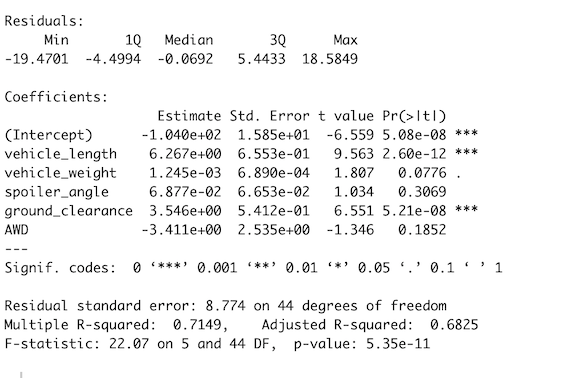
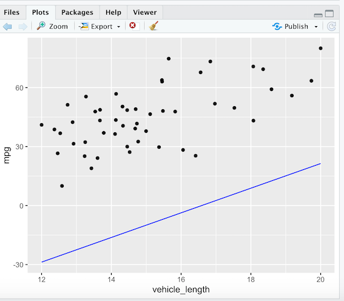
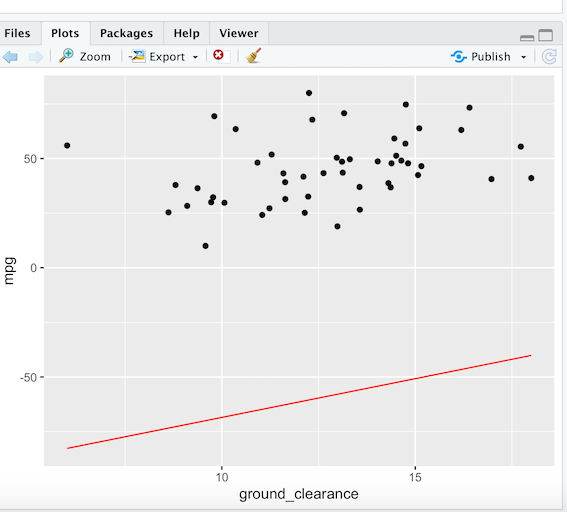
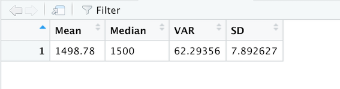
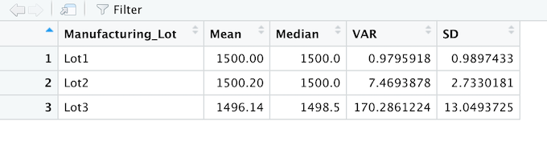
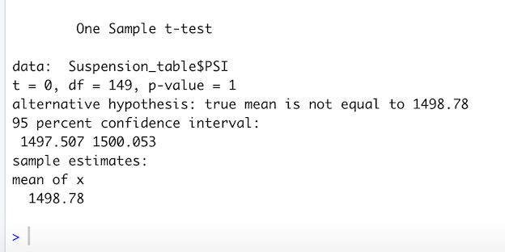

# MechaCar_Statistical_Analysis

## Linear Regression to Predict MPG
 We are using the multi-line linear regression model against the MechaCar data. We include all  variables in the formula.
The Summary of the linear regression model shows that the vehicle_length and ground_clearance have a significant impact on the mpg.

R-Squared value of 0.7149 shows that these variables have 70% likelihood that the future data points will fit into the linear model.
The p-value (5.35e-11) is extremely small indicating we can reject the null hypothesis.

### Summary Statistics on Suspension
In this analysis we create summary statistics for the dataset Suspension_Coil.csv. This dataset shows the Pounds per square inch (PSI) for each vehicle and manufacturing lot. The design specifications dictate that the variance of the suspension coils must not exceed 100 PSI. As we see from the charts below lot3 does not meet this specification

#### T-Tests on Suspension Coils
In the results, the p-value of 1 confirms the hypothesis one that there is no statistical difference between PSI across all manufacturing lots from the population mean of 1,500 pounds per square inch.If we compare the PSI of each manufacturing lot against the mean of population we get the p-value of 1 that there is no statistical difference between the PSI of each manufacturing lot and the mean from population.

